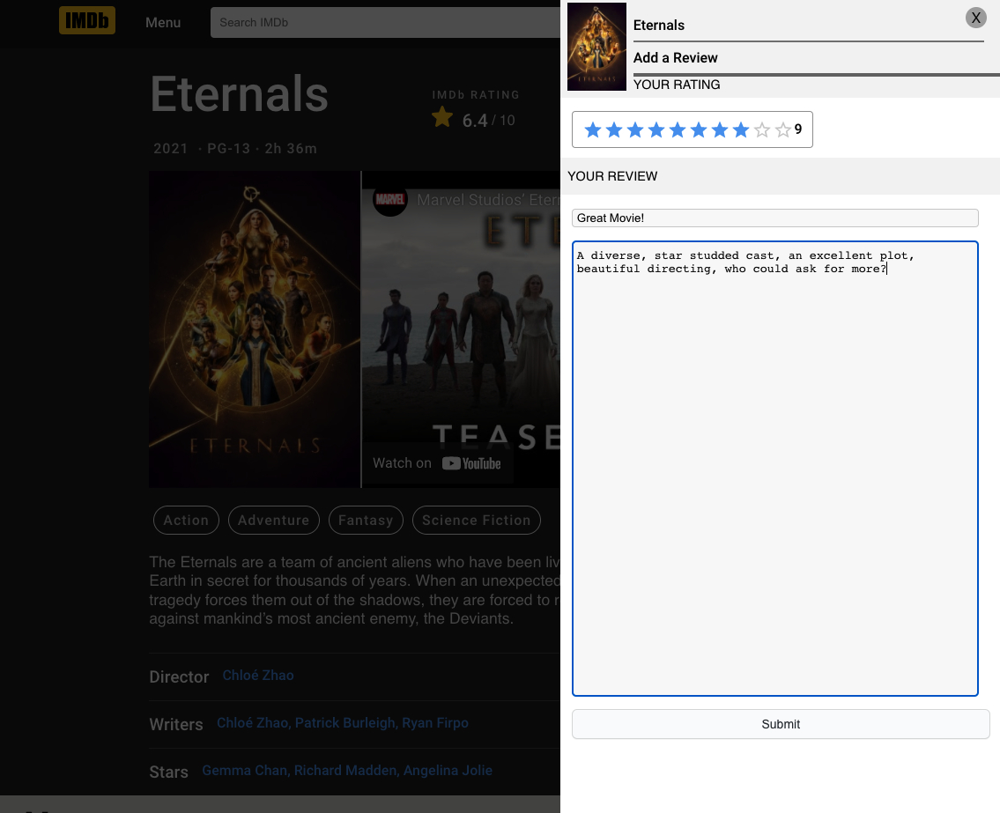
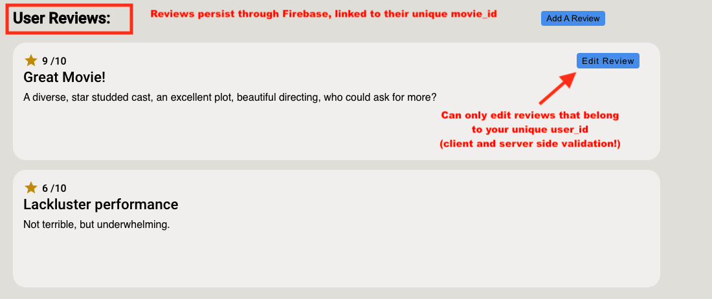
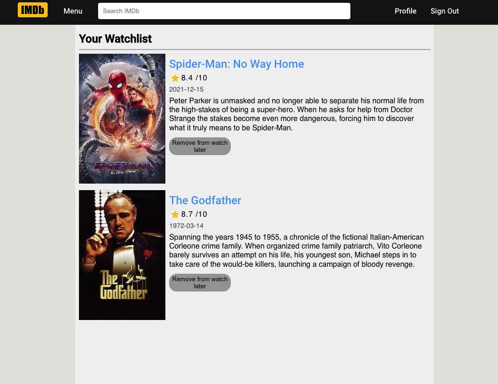

# A Movie Database Clone

## Functionality
- Google Authentication
- Persistent "Watch later" list of movies, with ability to add and remove items at will
- A Global-App-Level state management using dynamic data from an API, Redux, and Firebase Firestore
- A Review system that lets any unique user leave a review on a movie to be seen by all others
- Dynamically generated data from an API, the site has no data or assets (aside from icons and svgs) of its own

## Technologies Used
- React with TypeScript
- React Router & React Router DOM
- Redux
- Redux Dev Tools
- Styled Components
- Jest

### Things I Learned: 
- Data Modelling - especially in Firestore with ```Collection/ Document/ Collection/``` structure
- Redux, and its nuances like how it can be a bit verbose, but does provide incredibly stable app state management
- Dynamic Routes or Routes with parameters: The movie name get spliced into the URL path on navigation to the movies page
- Client and server side permissions and validations


## Pictures:




### Architecture:


## Project Planning:
I have attempted to be as thorough as possible in the planning phase of this project. The following is the result of that effort.

### Features and Entities:


### Attribution: 
This project makes use of TWO APIs
1. [The Movie Database](https://www.themoviedb.org/)
   
2. [The Open Movie Database](http://www.omdbapi.com/)

This site is not endorsed by or affiliated with IMDb.com.
This site was created and exists solely for the purpose of learning, if there are any issues with the use of any assets on the site, the author can be reached via the Repositories contact information
