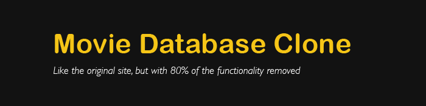
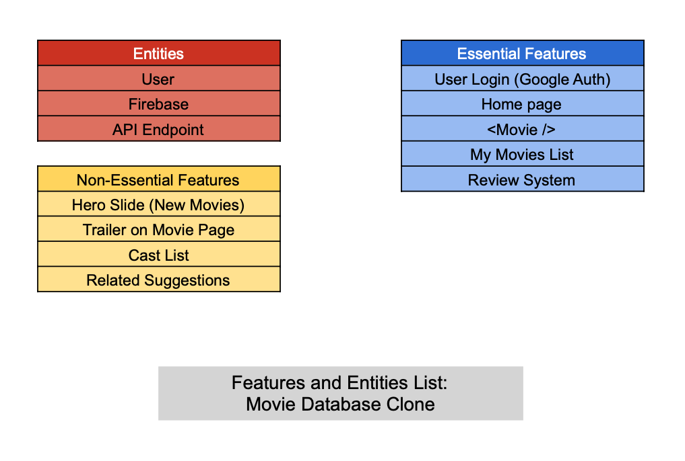
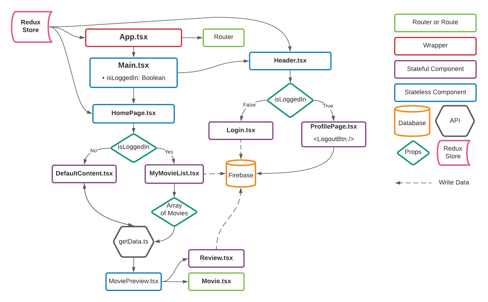
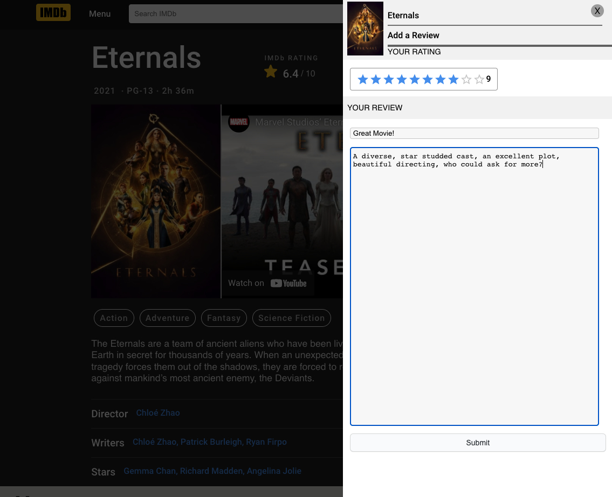
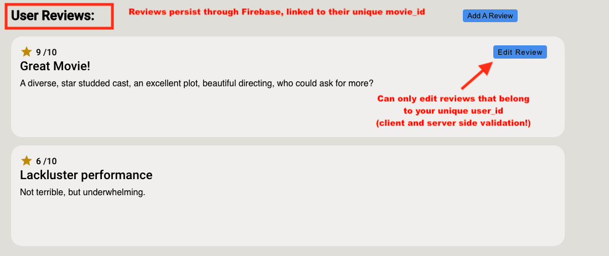
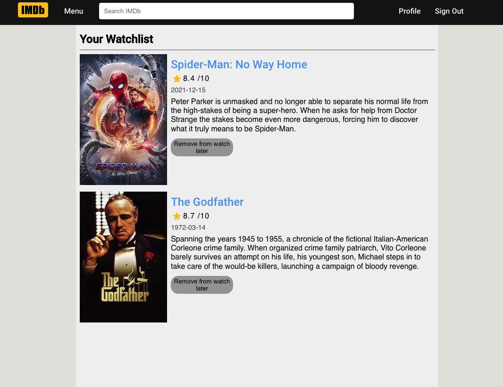

<div align="center">

## Movie Database Clone



</div>

### Table Of Contents:
1. [Live Deployment](#link-to-deployment)
2. [Getting Started](#getting-started)
3. [Description](#description)
4. [Pictures](#pictures)
5. [Functionality](#functionality)
6. [Technologies Used](#technologies-used)
7. [Things I Learned](#things-i-learned)
8. [License](#license)
9. [Acknowledgements](#acknowledgements)

### Link To Deployment
🖥 &nbsp; View a live demo of this project at: [Movie Database Clone](https://moviedatabaseclone.web.app/)

<sup>[Back to top](#table-of-contents)</sup>

## Getting Started

1. ⬇️ Clone the repository to your local machine
   ```shell
   git clone git@github.com:EpictetusZ1/movie-database-clone.git
   ```
2. Install project dependencies with npm
   ```shell
   npm install
   ```
3. 🏃‍ Run project
   ```shell
   npm run start
   ```

<sup>[Back to top](#table-of-contents)</sup>

## Description
An assignment from [The Odin Project](https://www.theodinproject.com/)

The motivation of this project was to re-create a site and some of its functionality from scratch, using the current live version of it as a template.

### Project Planning:

I have attempted to be as thorough as possible in the planning phase of this project. The following is the result of that effort.



Project architecture



*Note:* The project did not adhere to this plan verbatim, however, it provided an incredibly useful map to follow during development and helped me to build a well-structured project.


<sup>[Back to top](#table-of-contents)</sup>

## Pictures

Add a review



An example review



Watch later



<sup>[Back to top](#table-of-contents)</sup>

## Functionality

- Google Authentication
- Persistent "Watch later" list of movies, with ability to add and remove items at will
- A Global (app-level) state management using dynamic data from an API, Redux, and Firebase Firestore
- A Review system that lets any unique user leave a review on a movie to be seen by all others
- Review protection, can only edit review that was written by you
- Dynamically generated data from an API, the site has no data or assets (aside from icons and svgs) of its own

<sup>[Back to top](#table-of-contents)</sup>

## Technologies Used

- React
   - React Router
   - React Router DOM
   - Styled Components
- Redux
   - Redux DevTools
- TypeScript
- Jest

<sup>[Back to top](#table-of-contents)</sup>

## Things I Learned

- Data Modelling - especially in Firestore with ```Collection / Document / Collection /``` structure
- Redux, and its nuances like how it can be a bit verbose, but does provide incredibly stable application state management
- Dynamic Routes or Routes with parameters. The movie name gets spliced into the URL path on navigation to the movies detail page:
   ```javascript 
   <Route path={"/movie/:title"} element={<MoviePage />} />
  ```
- Client and server side permissions and validations

<sup>[Back to top](#table-of-contents)</sup>

## License
Distributed under the MIT License. See `LICENSE.txt` for more information.

<sup>[Back to top](#table-of-contents)</sup>

## Acknowledgements

This project makes use of two APIs
1. [The Movie Database](https://www.themoviedb.org/)

   

3. [The Open Movie Database](http://www.omdbapi.com/)

This site is not endorsed by or affiliated with IMDb.com in any way.
This site was created and exists solely for the purpose of learning, if there are any issues with the use of any assets on the site, the author can be reached via this repositories contact information

Project was authored by Jack Heaton - ([EpictetusZ1](https://github.com/EpictetusZ1)).

<sup>[Back to top](#table-of-contents)</sup>
